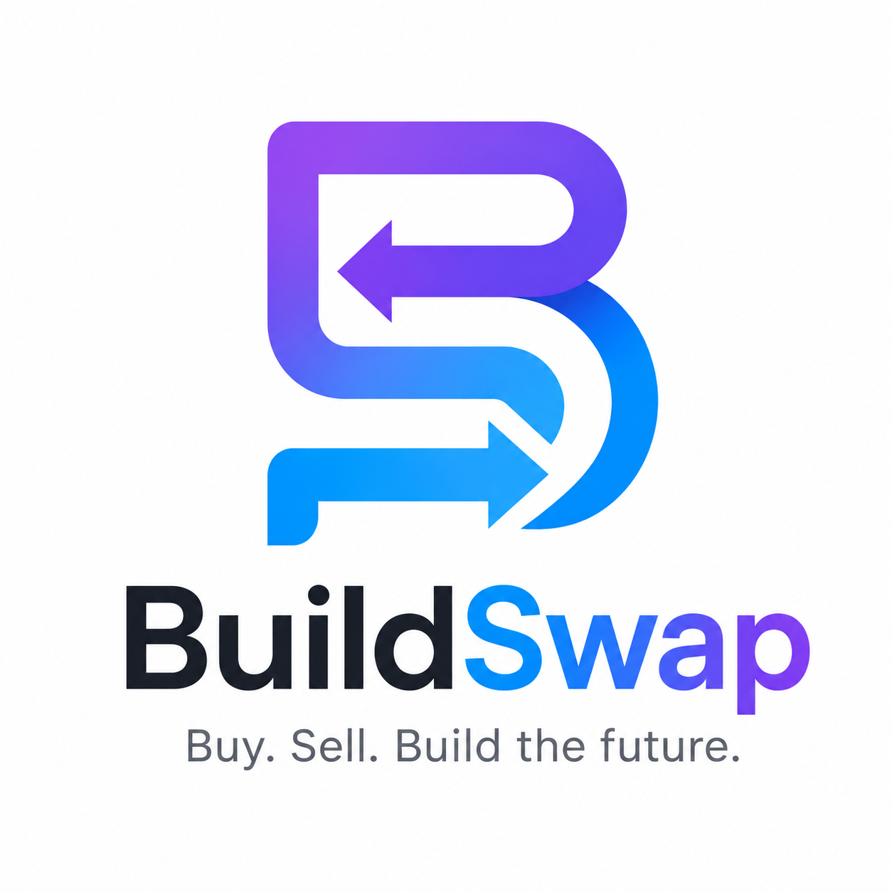

  <picture>
    <source media="(prefers-color-scheme: dark)" srcset="./assets/dark_logo.png">
    <source media="(prefers-color-scheme: light)" srcset="./assets/light_logo.png">
    
  </picture>

<h1 align="center">Hi, I'm Raghav Garg 👋</h1>

Founder of <strong>BuildSwap</strong> • AI & ML Graduate from <strong>Maharaja Agrasen Institute of Technology (MAIT)</strong>

Building technology products with AI, modern software engineering, and a passion for solving real-world problems.

---

# 🚀 Currently Building

## BuildSwap

BuildSwap is a marketplace for buying and selling software businesses.

Whether you're looking to acquire or sell a SaaS product, AI tool, mobile app, Chrome extension, API, developer tool, or source code business, BuildSwap is designed to make the process simpler, more transparent, and more secure.

The platform is currently in **Beta** and is being actively improved with a strong focus on security, scalability, and user experience.

🌐 **Website:** https://buildswap.online

---

# 💡 About Me

I'm an AI & ML graduate who enjoys turning ideas into real products.

My interests lie at the intersection of:

- Artificial Intelligence
- Product Development
- Software Architecture
- Startup Building
- AI-Assisted Software Engineering

I believe AI is transforming the way software is built, and I'm passionate about learning how developers can combine human creativity with AI to build better products faster.

---

# 🛠 Technologies

### Frontend

- Next.js
- React
- TypeScript
- Tailwind CSS

### Backend

- Supabase
- PostgreSQL

### Infrastructure & Tools

- Git & GitHub
- Netlify
- Resend
- Zoho Mail

---

# 🤖 AI-Assisted Development

BuildSwap has been developed using an AI-assisted engineering workflow.

I use AI throughout the software development lifecycle to support:

- Product planning
- Architecture design
- Sprint planning
- Feature implementation
- Documentation
- Code reviews
- Testing & QA
- Technical debt analysis
- Production readiness

I see AI not as a replacement for engineering, but as a collaborative tool that helps accelerate development while maintaining thoughtful design and high engineering standards.

---

# 🎯 Current Focus

My current priorities include:

- Improving BuildSwap through beta feedback
- Building scalable and secure software systems
- Exploring practical applications of AI in software engineering
- Continuously learning and improving as a founder and builder

---

# 🌱 Looking Ahead

My goal is to build products that solve meaningful problems through thoughtful design, scalable technology, and practical applications of AI.

BuildSwap is the first step in that journey, and I'm excited to continue learning, building, and sharing what I discover along the way.

---

# 📫 Connect

🌐 **Website**  
https://buildswap.online

📧 **Email**  
hello@buildswap.online

💻 **GitHub**  
https://github.com/BuildSwap

---

Thanks for visiting my profile! 🚀

